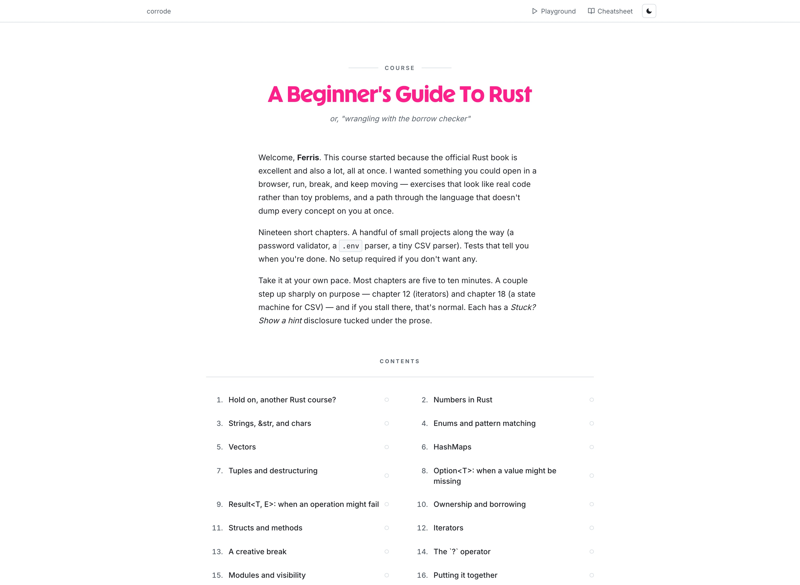

# A Beginner's Guide to Rust 



[Take the free, interactive Rust course for beginners](https://course.corrode.dev/).
Practice in your browser, with no installation or signup needed to start.

A hands-on Rust course for working developers. You write small programs, the
compiler gives you feedback, and after a couple of dozen exercises you start to
get the hang of it.

This is an official course repository by [corrode](https://corrode.dev), a Rust
consultancy that helps teams adopt Rust in production.

## How It Works

The course runs primarily through the website, which walks you through each
chapter, shows the exercises in your browser, and tracks your progress. That's
the recommended way to take it.

You can work through it on your own or with a team. With a team, you can submit
your solutions and compare approaches with each other. Either way, take it at
your own pace.

If you'd rather stay in your editor, this is also just a regular Rust project.
Clone it, open it in your IDE, and work through the exercises under `examples/`.

Each chapter is a numbered directory under `examples/`. Work through its `.md`
prose and `.rs` exercises in filename order. Replace the `todo!()` bodies in the
exercise files and run the tests until they pass. The chapter's generated
`main.rs` only connects the steps for Cargo, so don't edit it directly.

If you get stuck, there's a sample solution for every exercise under
`solutions/`. It mirrors the chapter and filename layout under `examples/`.
These are the same solutions the website reveals in its hints.

The workflow is roughly:

```bash
git clone https://github.com/corrode/course.git
cd course
# Edit examples/00_numbers_in_rust/3_add_health.rs, then test the whole chapter:
cargo test --example 00_numbers_in_rust
# Or run just that step's tests:
cargo test --example 00_numbers_in_rust _3_add_health::
```

## CLI

Install the CLI from the repository root (with Rust and Cargo installed):

```bash
cargo install --path crates/cli --bin cargo-course
cargo course init
cargo course submit examples/00_numbers_in_rust/3_add_health.rs
cargo course status
cargo course open
```

Run these commands from the repository root. `init` asks for your name and
registers you, saving your token in `.corrode/token`. To reuse a website token,
run `cargo course init --token <TOKEN>` (`-t` also works). `cargo course token`
prints the saved token; keep it private.

`submit <FILE>` runs the exercise's tests and uploads its source and results.
Add `--pedantic` to also check formatting and Clippy. Use
`cargo course submit --all` to submit every exercise that passes its tests;
this can also take `--pedantic`. A file is required unless you use `--all`.

The CLI connects to `https://course.corrode.dev` by default. For a workshop or
local server, set `CORRODE_SERVER_URL` before running the CLI:

```bash
export CORRODE_SERVER_URL=http://localhost:3000
cargo course init
```

Tokens belong to the server that issued them. Plain `init` keeps an existing
saved token; use `init --token <TOKEN>` to replace it when switching servers.

## Running the Server Locally

From the repository root, set `CORRODE_ADMIN_TOKEN` in your environment or
`.env`, then run:

```bash
cargo run --bin server
```

Open `http://localhost:3000`. `PORT` overrides the port, and `DATABASE_URL`
overrides the default local SQLite database. Keep the working directory at the
repository root so the server can find `examples/`, `solutions/`, `migrations/`,
and `static/`.

The workspace contains the CLI (`crates/cli`), shared API types
(`crates/course-types`), and the server (`crates/server`). The dependency-free
root package owns the exercise targets. All four are default members, but use
the explicit `--bin server` command rather than bare
`cargo run`. Exercise commands such as `cargo test --example 00_numbers_in_rust` still
work from the root. `make build`, `make check`, `make test`, and `make clippy`
cover the workspace infrastructure; `make examples` checks the teaching code
separately, including chapters that intentionally do not compile.
`make workspace-check` builds the binaries and smoke-tests the CLI and server
with a temporary database and learner crate (requires Python 3, rustfmt, and
Clippy; the smoke check uses no external network).

## About corrode

[corrode](https://corrode.dev) helps teams adopt Rust in production: training,
code reviews, and architecture work. If you'd like a workshop or a review of
your codebase, [get in touch](https://corrode.dev/services).
